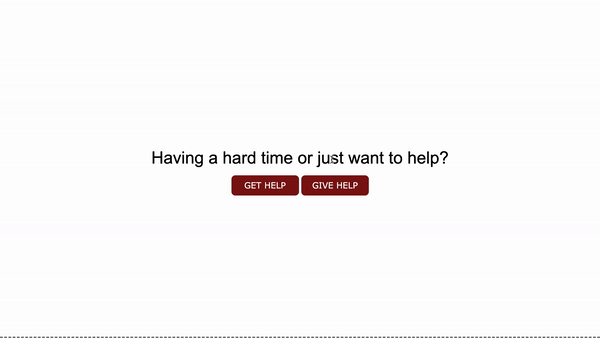

# Servicely
A simple app that lets you either seek help or help others in need.

## Table of Contents
1. [ Description ](#desc)
2. [ Visuals ](#visuals)
3. [ Deployed Webpage ](#deployed)
4. [ Support ](#support)
5. [ Next Steps ](#next_steps)
6. [ Authors and Acknowledgement ](#acknowledge)
7. [ License ](#license)

## 1. Description
This app (currently) displays charity information depending on the users location. If the user has geolocation enabled in their browser and wishes to share their location, then the location is entered automatically. Should this not be the case, a modal box appears asking the user to enter their city and state-code. 

### Note:
The particular functionality of entering the city and state-code does not work for users located outside of the United States. The geolocation functionality appears to work for at least certian areas in Canada as well as in the US.

### APIs Used:
APIs used include:
1. OrgHunter API for charities in the user's area
1. Wikipedia API for charity descriptions (will change if incorrect) 

## 2. Visuals
One visual example of the functionality

## 3. Deployed Webpage
[The deployed site](https://fulcrum-ctrl.github.io/Project-1-/), hosted by GitHub Pages.

## 4. Support
Should you find an issue with this webpage, please create a [new issue](https://github.com/fulcrum-ctrl/Project-1-/issues/new/choose) on my GitHub repository.

## 5. Next steps
Several features could be added, some of them are as follows:
* Definitely use an API that has better inclusion of Canadian cities
* Add functionality for several uses including (but not limited to):
    + the ability to search for jobs in your area according to some specifications,
    + the ability to find housing in your area,
    + the ability to find legal services offered in your area,
    + the ability to find places to volunteer.

## 6. Authors and Acknowledgement
This site was created by Omair Muhi, Karl Emmanuel Tulio, and Natasha Fray.

## 7. License
This project is covered by the [MIT](LICENSE) license.

