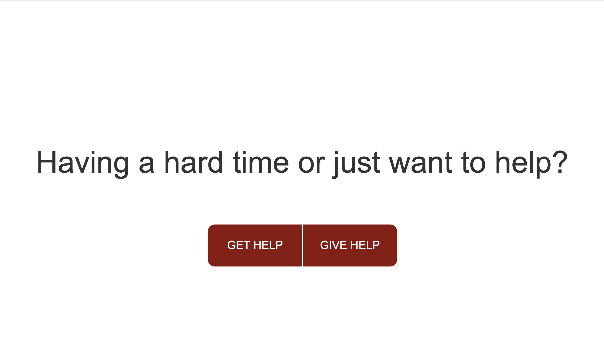
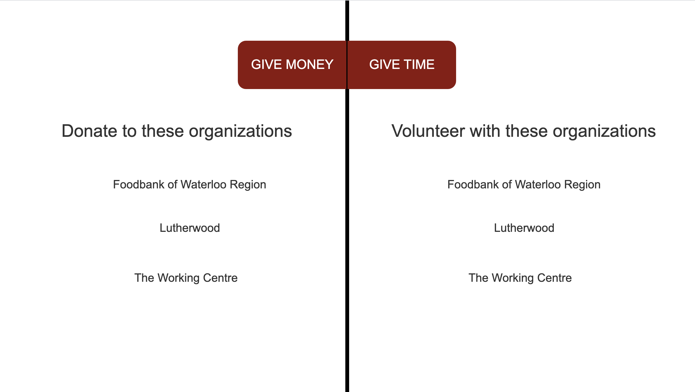

# Servicely: A web-portal for matching services with volunteers and the needful
​
## Project Description
People often themselves in situations where they feel like helping out or where they are in a tight spot and need help. This web-application is intended to help users in both these situations. It allows a user to select whether they would like to offer help (by donating to a charity or volunteering at an organization) or if they are looking for help (for example employment or health services).
​
---
## User Stories
### 1. User Story - Give Help with Money
​
```
AS a person who would like to give money
I WANT to view a list of charities
SO THAT I can choose and donate to one closest to my location
```
​
### Acceptance Criteria
​
```
WHEN I select HELP
THEN I am presented with an option to 'Give Money'
WHEN I select 'Give Money'
THEN I am presented with a list of charities requiring donations
WHEN I select a charity
THEN I am presented with their contact info and/or a website where I can securely donate
```
​
### 2. User Story - Give Help with Time
​
```
AS a person who would like to volunteer
I WANT to view a list of volunteer organizations
SO THAT I can choose and volunteer at one closest to my location
```
​
### Acceptance Criteria
​
```
WHEN I select HELP
THEN I am presented with an option to 'Give Time'
WHEN I select 'Give Time'
THEN I am presented with a list of volunteer positions in my area
WHEN I click on a position
THEN I am presented with an application and/or contact info
```
​
​
### 3. User Story - Get Help with Legal Services
​
```
AS someone who needs legal counsel
I WANT to view a list of law offices
SO THAT I can contact the one closest to my location
```
​
### Acceptance Criteria
​
```
WHEN I select 'Get Help'
THEN I am presented with an option to 'Get Legal Help'
WHEN I select 'Legal Help'
THEN I am presented with a list of affordable legal aid in my area and contact info
```
​
### 4. User Story - Get Help with Housing
​
```
AS someone who is looking for housing
I WANT to view a list of rental agencies
SO THAT I can contact the one closest to my location
```
​
### Acceptance Criteria
​
```
WHEN I select 'Get Help'
THEN I am presented with an option to 'Get Housing'
WHEN I select 'Housing'
THEN I am presented with several places that can help me find housing in my area / desired area
```
​
### 5. User Story - Get Help with Work
​
```
AS someone who is unemployed
I WANT to view a list of labor agencies
SO THAT I can contact the one closest to my location
```
​
### Acceptance Criteria
​
```
WHEN I select 'Get Help'
THEN I am presented with an option to 'Get Work'
WHEN I select 'Get Work'
THEN I am presented with a list of places looking for short term work in my area
```
---
## APIs used
1. orgHunter - Charity API
2. BetterDoctor API
3. The Muse API (job search engine)
4. Google Maps API
---
## Team Mates
1. Natasha Fray
2. Omair Muhi
3. Karl Emmanuel L. Tulio
---
## Design mock-up

​

